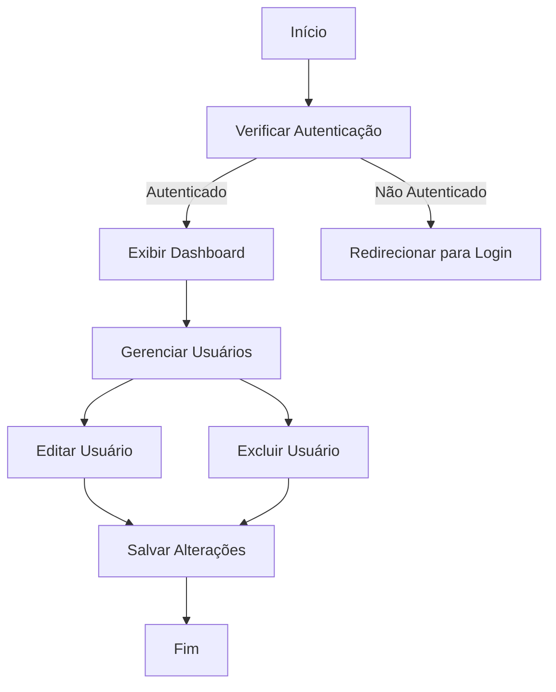

# Fluxo de Usuários

Este fluxograma representa o fluxo básico de gerenciamento de usuários dentro do sistema, começando pela verificação de autenticação e permitindo ações como edição e exclusão de usuários.
